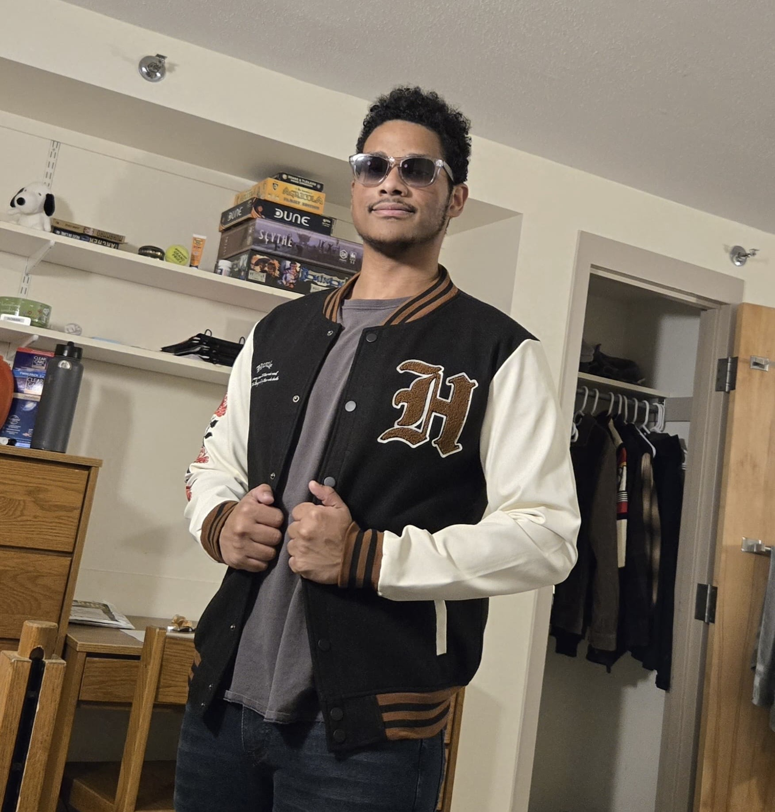

# Guitar Tuner Project

A brief guide into our project journey.

---

## Meet the Team

<table class="team-table">
  <tr>
    <td align="center">
      
       
      <strong>Gerson</strong>
    </td>
    <td align="center">
      
       
      <strong>Charlie</strong>
    </td>
    <td align="center">
      
       
      <strong>Edy</strong>
    </td>
    <td align="center">
      
       
      <strong>Professor Vaccari</strong>
    </td>
  </tr>
</table>

---

## Project Pages

- [Introduction](introduction.md)
- [Results](results.md)
- [Schedule](schedule.md)
- [Issues](issues.md)
- [Ethics](ethics.md)
- [Accessibility](accessibility.md)
- [Materials](Material.html)
- [References](references.md)
