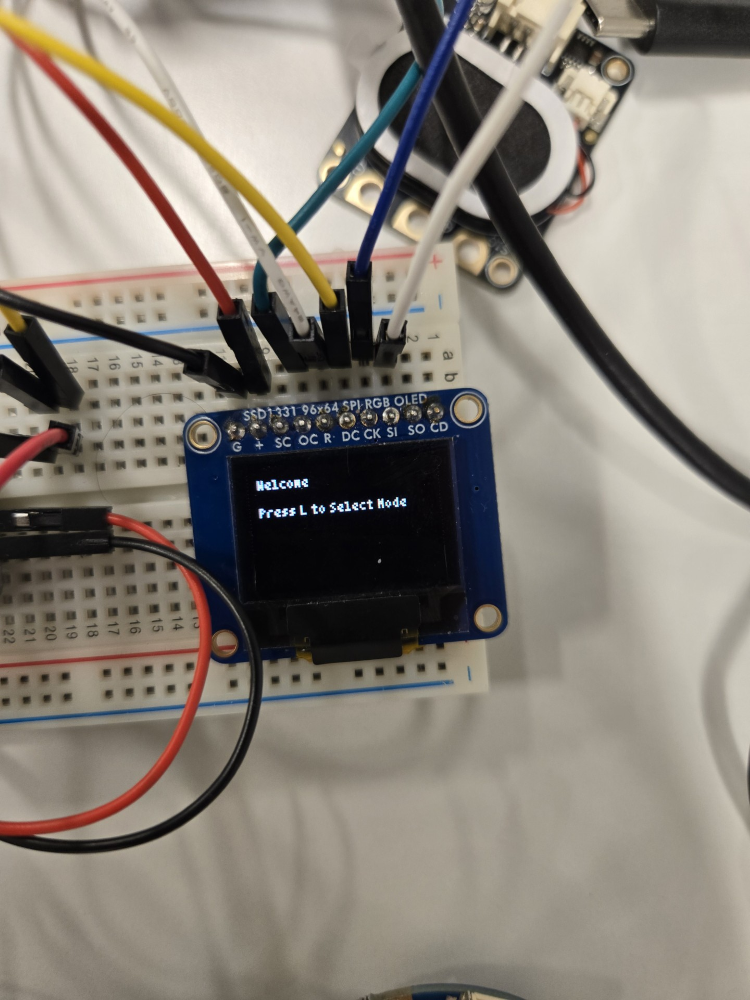
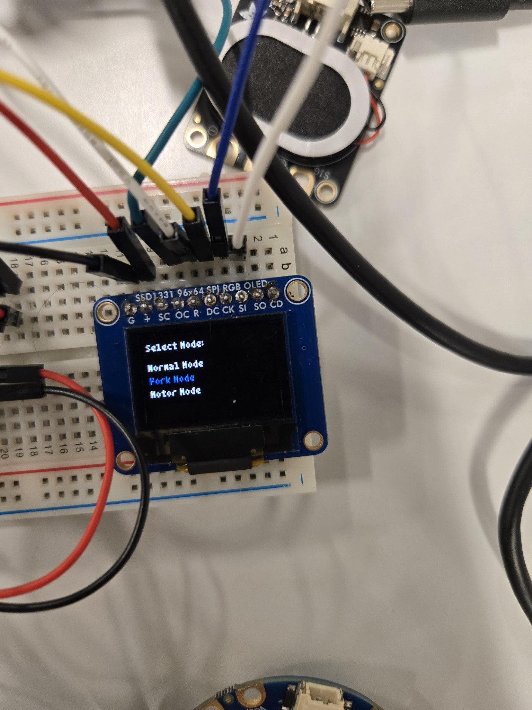
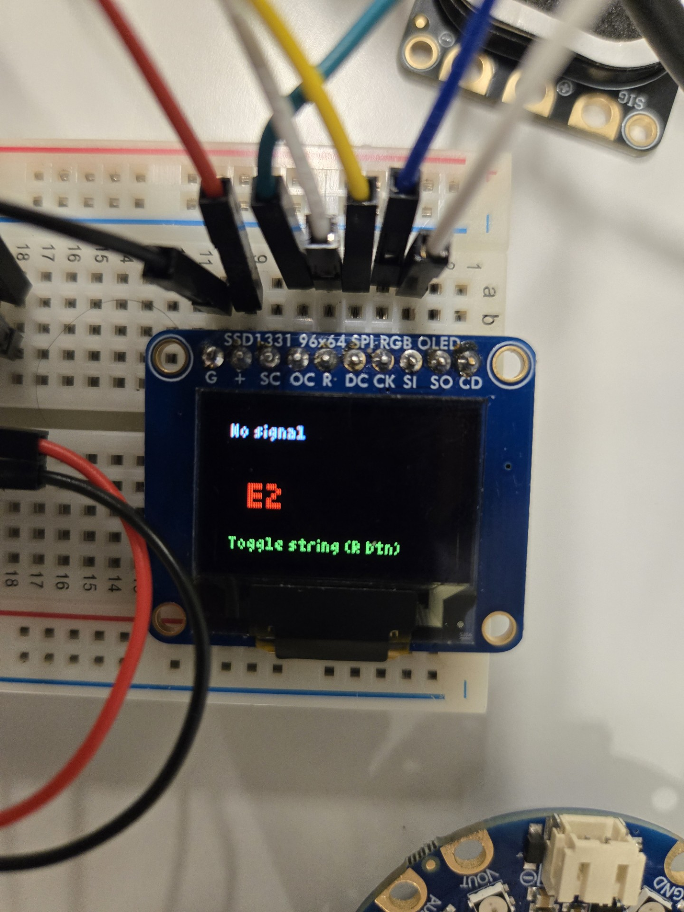
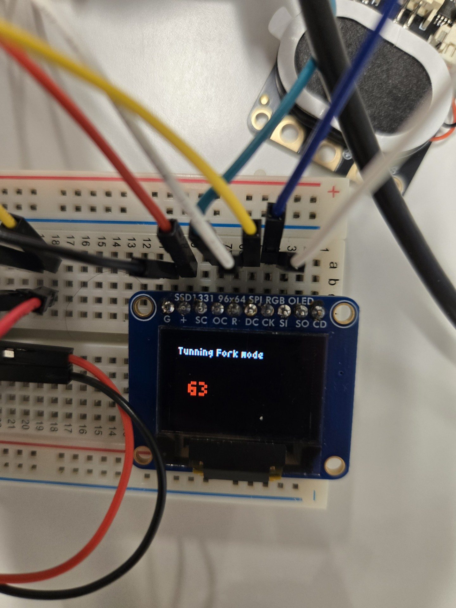
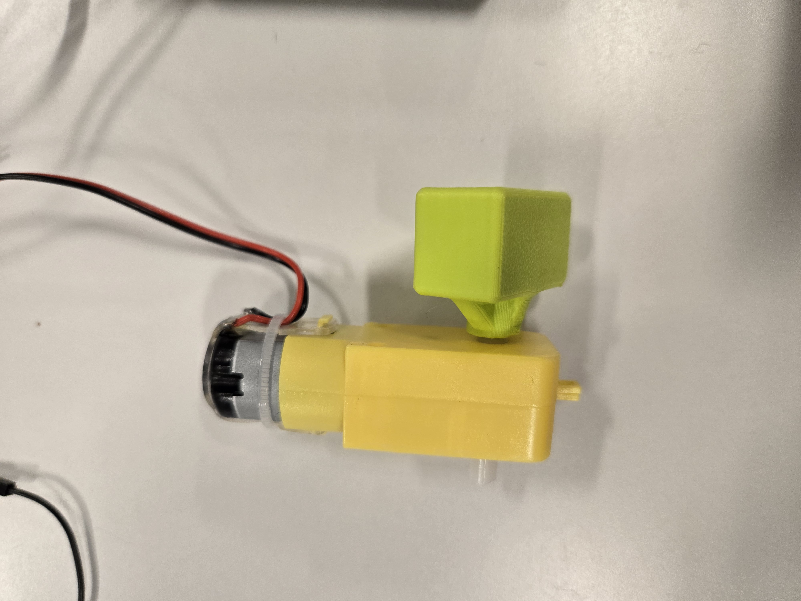
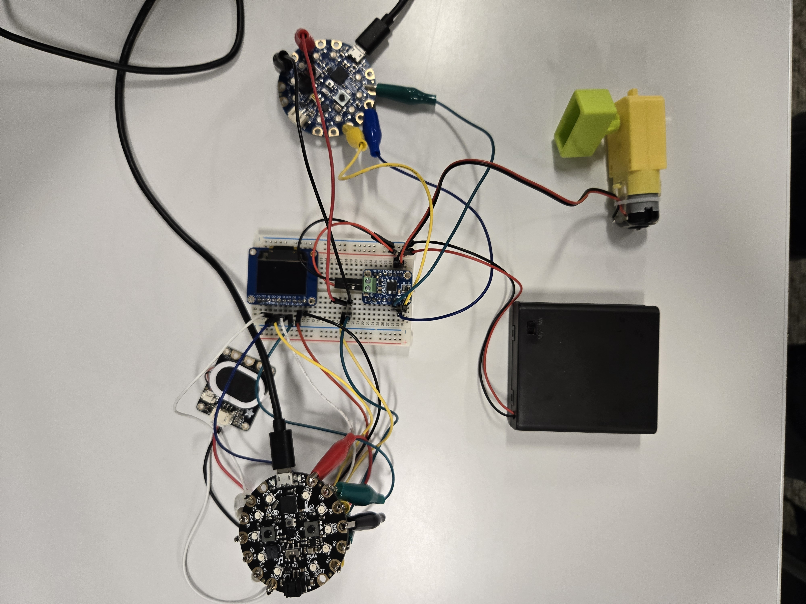

The guitar tuner starts off. When both the right and left buttons are pressed it boots up into the title screen. At any point the user can press left and right buttons in order to turn off the tuner.

  

During this mode, if L is pressed it goes into selection mode which allows for three different options, normal, tuning fork and motor modes. When L is pressed during selection mode, it comfirms the mode. If L is pressed during any of these modes it goes back to allow for the user to select a different mode.

  

Normal Mode allows the user to to select a note and tune the guitar string accordingly. We are assuming that each string is relatively close to its actual tone, so in order to improve oled performance any "cents" way above the notes range is ignored. There are also audio cues for when a note is in tune.

  

Tuning Fork Mode uses the speaker to its fullest potential by playing a tone that matches the note displaced on screen. This mode is very manual as it is meant to be used for the user to tune the guitar using their ears and sense of pitch by playing it out loud.

  

Motor Mode theroetically allows for the user to automatically tune the guitar based on which note is on the current screen. The motor and the driver are in charge of this task. At the current moment however the motor itself is too weak to push the pegs even if it would currently be in the correct direction to tune it.

  

  

